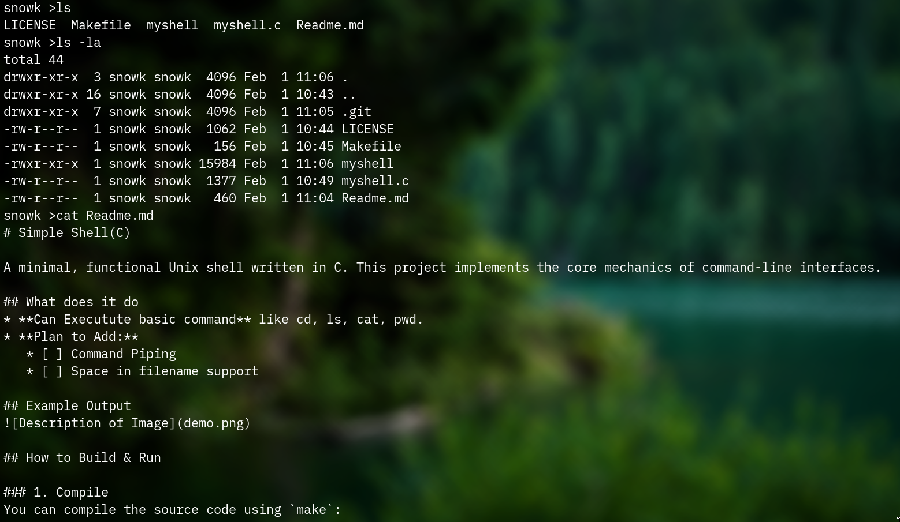

# Simple Shell(C)

A minimal, functional Unix shell written in C. This project implements the core mechanics of command-line interfaces.

## What does it do
* **Can Executute basic command** like cd, ls, cat, pwd.
* **Plan to Add:** 
   * [ ] Command Piping 
   * [ ] Space in filename support

## Example Output


## How to Build & Run

### 1. Compile
You can compile the source code using `make`:
```bash
make
sudo ./myshell
